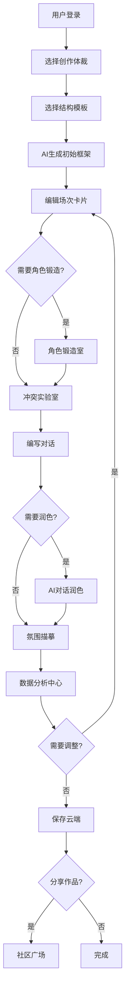
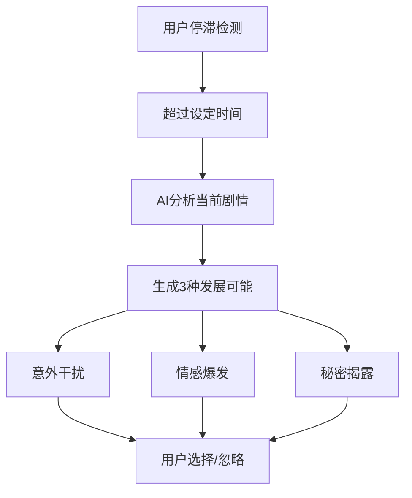

## 1. 产品概述

一款AI辅助的智能剧本创作工具，服务于影视编剧、短剧创作者、小说家及视频UP主，涵盖电影长片、电视剧集、短视频脚本、舞台剧及互动游戏剧本等多元体裁。打造专业、高效且富有灵感启发性的沉浸式创作体验。

## 2. 核心功能

### 2.1 用户角色

| 角色 | 注册方式 | 核心权限 |
|------|----------|----------|
| 普通用户 | 邮箱/手机号/社交账号 | 基础创作功能、云存储、社区浏览 |
| 创作者 | 完成实名认证 | 作品发布、社区互动、成就系统 |
| 管理员 | 后台配置 | 内容审核、赛事管理、系统设置 |

### 2.2 功能模块

1. **首页仪表盘**：创作入口、灵感推荐、社区动态、成就展示
2. **剧本编辑器**：分级结构模板、AI辅助创作、实时预览
3. **数据分析中心**：进度追踪、角色分析、场景热力图、节奏诊断
4. **角色锻造室**：AI人物小传生成、角色关系管理
5. **冲突实验室**：情节冲突推荐、升级路径规划
6. **社区广场**：作品分享、匿名互评、剧本接龙
7. **成就中心**：勋章系统、积分商城、创作挑战赛

### 2.3 页面详情

| 页面名称 | 模块名称 | 功能描述 |
|----------|----------|----------|
| 首页仪表盘 | 创作入口 | 快速创建新项目、最近作品列表、创作统计概览 |
| 首页仪表盘 | 灵感推荐 | 基于偏好的剧情走向推荐、热门题材榜单 |
| 首页仪表盘 | 社区动态 | 精选作品展示、实时接龙活动、赛事公告 |
| 剧本编辑器 | 结构模板 | 三幕式/五幕式/救猫咪节拍表/多线叙事/短视频模板切换 |
| 剧本编辑器 | 场次卡片 | 场景标题、内外景、角色清单自动生成 |
| 剧本编辑器 | AI对话润色 | 多种风格改写（诙谐/含蓄/爆发力/专业术语） |
| 剧本编辑器 | 氛围描摹 | 根据关键词生成镜头感环境描写 |
| 数据分析中心 | 进度追踪 | 按幕/场/页数统计完成度可视化 |
| 数据分析中心 | 角色分析 | 台词占比、出场频次、戏份均衡检测 |
| 数据分析中心 | 节奏诊断 | 平淡段落识别、节奏调整建议 |
| 角色锻造室 | AI生成 | 输入基础人设生成深度人物小传 |
| 角色锻造室 | 关系管理 | 角色关系图谱、冲突节点推荐 |
| 冲突实验室 | 冲突推荐 | 根据角色关系推荐情节冲突节点 |
| 冲突实验室 | 升级路径 | 冲突升级策略规划 |
| 社区广场 | 作品分享 | 部分脱敏分享、匿名发布 |
| 社区广场 | 互评系统 | 匿名评论、评分反馈 |
| 社区广场 | 剧本接龙 | 多人协作续写玩法 |
| 成就中心 | 勋章系统 | 处女作完成、百万字里程碑、连续日更等 |
| 成就中心 | 积分商城 | AI模型解锁、专属封面模板兑换 |
| 成就中心 | 创作挑战赛 | 季度主题赛事、流量扶持奖励 |
| 用户中心 | 账户管理 | 注册登录、个人资料、安全设置 |
| 用户中心 | 云端资产 | 历史版本回溯、多端同步管理 |

## 3. 核心流程

### 3.1 创作流程

用户登录 → 创建项目（选择体裁与结构模板）→ AI生成初始框架 → 编辑场次卡片 → 角色锻造 → 冲突设计 → 对话润色 → 氛围描摹 → 数据分析调整 → 保存云端 → 分享/发布

### 3.2 流程图

### 3.3 卡文救援流程

## 4. 用户界面设计

### 4.1 设计风格

- **主色调**：深邃午夜蓝 (#0A1628) 为主背景，配合琥珀金 (#D4A574) 作为强调色
- **辅助色**：科技紫 (#6B4E71) 用于AI功能，森林绿 (#2D5A4E) 用于进度指示
- **按钮风格**：圆角矩形，悬浮时有轻微缩放和阴影变化
- **字体**：标题使用 Playfair Display（衬线体，优雅文艺），正文使用 Lora（可读性强），代码使用 JetBrains Mono
- **布局**：左侧导航栏 + 中间工作区 + 右侧属性面板的三栏布局
- **图标**：线性风格，简洁现代

### 4.2 页面设计概览

| 页面名称 | 模块名称 | UI元素 |
|----------|----------|--------|
| 首页仪表盘 | 创作入口 | 大卡片式布局，悬停动画，渐变背景 |
| 首页仪表盘 | 灵感推荐 | 横向滚动卡片，卡片翻转效果 |
| 剧本编辑器 | 结构模板 | 标签切换，预览面板，场次树状导航 |
| 剧本编辑器 | AI工具 | 浮动工具栏，模态对话框，实时预览 |
| 数据分析中心 | 进度追踪 | 环形进度条，进度瀑布图 |
| 数据分析中心 | 角色分析 | 雷达图，条形图，热力图 |
| 角色锻造室 | 角色卡片 | 头像占位，标签云，关系连线 |
| 社区广场 | 作品列表 | 瀑布流布局，投票按钮，分享图标 |
| 成就中心 | 勋章墙 | 网格布局，解锁动画，进度条 |

### 4.3 响应式设计

- **桌面端**：1200px+，三栏完整布局
- **平板端**：768px-1199px，侧边栏可折叠，双栏布局
- **移动端**：<768px，底部导航，单栏布局，模态面板

### 4.4 交互细节

- **入场动画**：页面加载时元素依次淡入
- **悬停效果**：卡片、按钮悬停时有缩放和阴影
- **AI生成**：打字机效果展示生成内容
- **进度更新**：数字变化时有平滑过渡动画
- **成就解锁**：弹出庆祝动画和粒子效果
