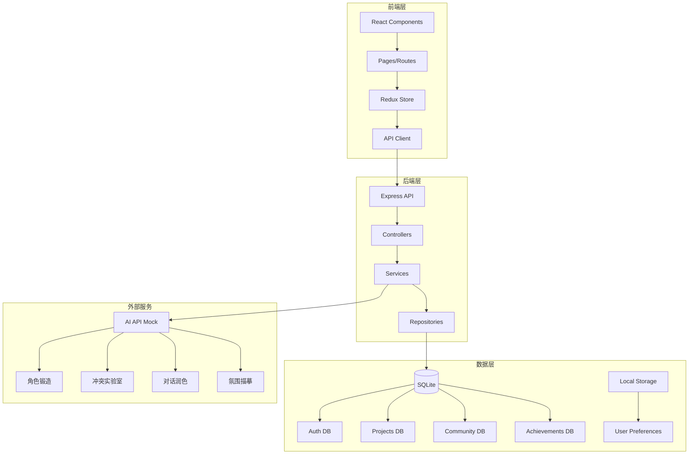
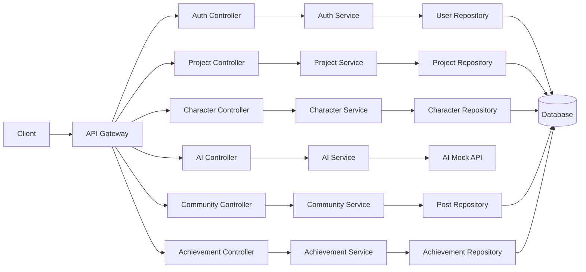
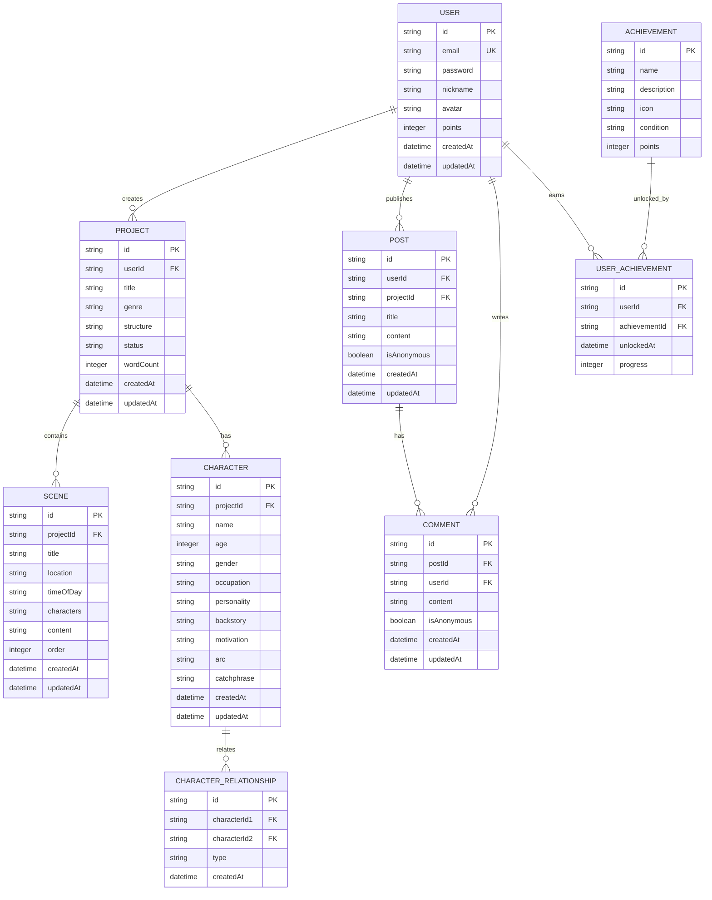

## 1. 架构设计



## 2. 技术选型

- **前端框架**: React@18 + TypeScript
- **构建工具**: Vite@6
- **样式**: TailwindCSS@3 + Lucide React Icons
- **状态管理**: Redux Toolkit + Redux Persist
- **路由**: React Router DOM@6
- **图表**: Chart.js + react-chartjs-2
- **动画**: Framer Motion
- **后端**: Express@4 + TypeScript
- **数据库**: SQLite (本地开发) + Prisma ORM
- **认证**: JWT + bcryptjs
- **Mock AI服务**: 本地模拟API

## 3. 路由定义

| 路由 | 用途 | 组件 |
|------|------|------|
| / | 首页仪表盘 | Dashboard |
| /editor/:id | 剧本编辑器 | Editor |
| /characters/:id | 角色锻造室 | CharacterStudio |
| /conflict/:id | 冲突实验室 | ConflictLab |
| /analytics/:id | 数据分析中心 | Analytics |
| /community | 社区广场 | Community |
| /achievements | 成就中心 | Achievements |
| /profile | 用户中心 | Profile |
| /login | 登录页面 | Login |
| /register | 注册页面 | Register |

## 4. API定义

### 4.1 认证接口

```typescript
interface AuthResponse {
  accessToken: string;
  user: User;
}

interface LoginRequest {
  email: string;
  password: string;
}

interface RegisterRequest {
  email: string;
  password: string;
  nickname: string;
}
```

### 4.2 项目接口

```typescript
interface Project {
  id: string;
  title: string;
  genre: 'commercial' | 'artistic' | 'short';
  structure: 'three_act' | 'five_act' | 'save_the_cat' | 'multi_line' | 'short_video';
  status: 'draft' | 'in_progress' | 'completed';
  createdAt: Date;
  updatedAt: Date;
}

interface Scene {
  id: string;
  projectId: string;
  title: string;
  location: 'interior' | 'exterior';
  timeOfDay: string;
  characters: string[];
  content: string;
  order: number;
}
```

### 4.3 角色接口

```typescript
interface Character {
  id: string;
  projectId: string;
  name: string;
  age: number;
  gender: string;
  occupation: string;
  personality: string;
  backstory: string;
  motivation: string;
  arc: string;
  catchphrase: string;
}

interface CharacterRelationship {
  id: string;
  characterId1: string;
  characterId2: string;
  type: 'friend' | 'enemy' | 'family' | 'lover' | 'colleague';
}
```

### 4.4 AI服务接口

```typescript
interface AICharacterRequest {
  name: string;
  age: number;
  gender: string;
  occupation: string;
  personality: string;
}

interface AICharacterResponse {
  backstory: string;
  motivation: string;
  arc: string;
  catchphrase: string;
}

interface AIDialogRequest {
  text: string;
  style: 'humorous' | 'subtle' | 'powerful' | 'professional';
}

interface AIDialogResponse {
  rewrittenText: string;
}

interface AIAtmosphereRequest {
  keywords: string[];
}

interface AIAtmosphereResponse {
  description: string;
  visualMetaphor: string;
}

interface AIConflictRequest {
  characterIds: string[];
}

interface AIConflictResponse {
  conflicts: string[];
  escalationPath: string[];
}
```

### 4.5 社区接口

```typescript
interface Post {
  id: string;
  userId: string;
  projectId: string;
  title: string;
  content: string;
  isAnonymous: boolean;
  createdAt: Date;
}

interface Comment {
  id: string;
  postId: string;
  userId: string;
  content: string;
  isAnonymous: boolean;
  createdAt: Date;
}
```

### 4.6 成就接口

```typescript
interface Achievement {
  id: string;
  name: string;
  description: string;
  icon: string;
  condition: string;
  points: number;
}

interface UserAchievement {
  id: string;
  userId: string;
  achievementId: string;
  unlockedAt: Date;
  progress: number;
}
```

## 5. 服务器架构



## 6. 数据模型

### 6.1 ER图



## 7. 项目结构

```
frontend/
├── src/
│   ├── components/
│   │   ├── layout/
│   │   ├── common/
│   │   ├── editor/
│   │   ├── dashboard/
│   │   ├── character/
│   │   ├── conflict/
│   │   ├── analytics/
│   │   ├── community/
│   │   └── achievement/
│   ├── pages/
│   ├── store/
│   ├── api/
│   ├── types/
│   ├── utils/
│   └── assets/
├── public/
├── index.html
├── package.json
├── vite.config.ts
├── tsconfig.json
└── tailwind.config.js

backend/
├── src/
│   ├── controllers/
│   ├── services/
│   ├── repositories/
│   ├── models/
│   ├── middleware/
│   ├── routes/
│   ├── utils/
│   └── server.ts
├── prisma/
├── package.json
├── tsconfig.json
└── .env
```
